# Disaster Response System - Vertex AI Agent Engine Deployment

This guide covers the deployment of the disaster response system to Google Cloud's Vertex AI Agent Engine platform.

## 📋 Overview

The Agent Engine deployment provides a cloud-native, scalable solution for deploying the disaster response multi-agent system. The system consists of three coordinated agents:

1. **DetectionAgent** - Reads sensor data from JSON files and logs to BigQuery
2. **AnalysisAgent** - Analyzes sensor data to determine risk levels
3. **AlertAgent** - Triggers appropriate alerts based on risk assessment

## 🏗️ Architecture

```
┌─────────────────────────────────────────────────────────────┐
│                    Vertex AI Agent Engine                   │
├─────────────────────────────────────────────────────────────┤
│  root_agent (SequentialAgent)                              │
│  ├── DetectionAgent → AnalysisAgent → AlertAgent           │
│  └── Pipeline: Detect → Analyze → Alert                   │
├─────────────────────────────────────────────────────────────┤
│  Google Cloud Services Integration                          │
│  ├── BigQuery (Historical data logging)                    │
│  ├── Cloud Logging (System monitoring)                     │
│  ├── Cloud Monitoring (Performance metrics)                │
│  └── IAM (Security & permissions)                          │
└─────────────────────────────────────────────────────────────┘
```

## 📂 File Structure

```
agent_engine/
├── __init__.py                 # Package initialization
├── agent.py                    # Main agent definition with root_agent
├── agent_config.yaml           # Vertex AI Agent Engine configuration
├── requirements.txt            # Python dependencies for deployment
├── deploy_agent.sh            # Automated deployment script
└── README_AGENT_ENGINE.md     # This documentation
```

## 🚀 Quick Start

### Prerequisites

1. **Google Cloud Project** with billing enabled
2. **gcloud CLI** installed and authenticated
3. **Python 3.10+** with required dependencies
4. **Appropriate IAM permissions** for Vertex AI and BigQuery

### Environment Setup

```bash
# Set your Google Cloud project
export GOOGLE_CLOUD_PROJECT="your-project-id"
export REGION="us-central1"  # Optional, defaults to us-central1
export AGENT_VERSION="v1.0.0"  # Optional, defaults to v1.0.0

# Authenticate with Google Cloud
gcloud auth login
gcloud config set project $GOOGLE_CLOUD_PROJECT
```

### Deployment

```bash
# Make deployment script executable (Linux/Mac)
chmod +x agent_engine/deploy_agent.sh

# Run deployment
./agent_engine/deploy_agent.sh
```

Or with environment variables:

```bash
GOOGLE_CLOUD_PROJECT=my-project REGION=europe-west4 ./agent_engine/deploy_agent.sh
```

## 🔧 Configuration

### Agent Configuration (`agent_config.yaml`)

The agent configuration defines:

- **Runtime settings**: Python version, memory, CPU, timeout
- **Scaling parameters**: Min/max replicas, CPU/memory targets
- **Input/Output schemas**: Data validation and structure
- **Security settings**: Service accounts, IAM permissions
- **Monitoring**: Health checks, metrics, logging

Key configuration sections:

```yaml
spec:
  agent:
    name: disaster_response_agent
    entrypoint:
      module: "agent_engine.agent"
      object: "root_agent"
    
  deployment:
    autoscaling:
      min_replicas: 0    # Scale to zero when idle
      max_replicas: 10   # Scale up under load
    
    resources:
      requests:
        memory: "512Mi"
        cpu: "0.25"
      limits:
        memory: "1Gi" 
        cpu: "0.5"
```

### Environment Variables

| Variable | Description | Default |
|----------|-------------|---------|
| `GOOGLE_CLOUD_PROJECT` | Google Cloud project ID | Required |
| `REGION` | Vertex AI region | `us-central1` |
| `AGENT_VERSION` | Agent version tag | `v1.0.0` |
| `ENVIRONMENT` | Deployment environment | `production` |
| `LOG_LEVEL` | Logging level | `INFO` |

## 📊 Input/Output Schema

### Input Schema

```json
{
  "type": "object",
  "properties": {
    "file_path": {
      "type": "string",
      "description": "Path to JSON file containing sensor data"
    },
    "pattern": {
      "type": "string",
      "description": "File pattern to match",
      "default": "*.json"
    },
    "bigquery_config": {
      "type": "object",
      "description": "Optional BigQuery configuration",
      "properties": {
        "project_id": {"type": "string"},
        "dataset_id": {"type": "string", "default": "disaster_response"},
        "table_id": {"type": "string", "default": "sensor_readings"}
      }
    }
  }
}
```

### Output Schema

```json
{
  "type": "object",
  "properties": {
    "pipeline_status": {
      "type": "string",
      "enum": ["completed", "failed"]
    },
    "risk_level": {
      "type": "string",
      "enum": ["Low", "Medium", "High"]
    },
    "priority": {
      "type": "string",
      "enum": ["NORMAL", "HIGH", "CRITICAL"]
    },
    "detection": {"type": "object"},
    "analysis": {"type": "object"},
    "alerts": {"type": "object"}
  }
}
```

## 🔐 Security & IAM

### Service Account

The deployment creates a dedicated service account: `disaster-response-agent-sa@{PROJECT_ID}.iam.gserviceaccount.com`

### Required IAM Roles

- `roles/bigquery.dataEditor` - Write sensor data to BigQuery
- `roles/bigquery.jobUser` - Execute BigQuery jobs
- `roles/logging.logWriter` - Write to Cloud Logging
- `roles/monitoring.metricWriter` - Write custom metrics

### Network Security

- **Egress**: HTTPS to `*.googleapis.com` and `bigquery.googleapis.com`
- **Authentication**: Service account-based
- **Encryption**: All data encrypted in transit and at rest

## 📈 Monitoring & Observability

### Custom Metrics

1. **agent_execution_duration** - Time taken to execute agent pipeline
2. **agent_success_rate** - Percentage of successful agent executions
3. **bigquery_logging_rate** - Rate of successful BigQuery data logging

### Health Checks

- **Path**: `/health`
- **Initial delay**: 30 seconds
- **Period**: 30 seconds
- **Timeout**: 10 seconds
- **Failure threshold**: 3 attempts

### Logging

- **Level**: INFO (configurable)
- **Format**: Structured JSON
- **Destinations**: Cloud Logging, stdout

## 🔄 Agent Pipeline Flow

```mermaid
graph LR
    A[Input: Sensor Data] --> B[DetectionAgent]
    B --> C[Read JSON Files]
    C --> D[Log to BigQuery]
    D --> E[AnalysisAgent]
    E --> F[Risk Assessment]
    F --> G[AlertAgent]
    G --> H[Generate Alerts]
    H --> I[Output: Results]
    
    style B fill:#e1f5fe
    style E fill:#f3e5f5
    style G fill:#fff3e0
    style I fill:#e8f5e8
```



## 🧪 Testing

### Local Testing

```bash
# Test agent import and configuration
cd agent_engine
python -c "
from agent import root_agent, AGENT_CONFIG
print(f'Agent: {root_agent.name}')
print(f'Sub-agents: {len(root_agent.sub_agents)}')
print('✅ Agent configuration valid')
"
```

### Integration Testing

```bash
# Run full pipeline test
python -m pytest ../python_agents/test_orchestrator.py -v
```

## 🚦 Deployment Status

### Current Status

The Agent Engine deployment structure is **READY** with:

✅ Agent definition (`root_agent`) with SequentialAgent  
✅ Complete configuration (`agent_config.yaml`)  
✅ Deployment script with full automation  
✅ Comprehensive documentation  
✅ Security configuration (service accounts, IAM)  
✅ Monitoring and health checks  
✅ Input/output schema validation  

### Pending Items

⚠️ **Vertex AI Agent Engine CLI commands** - Update `deploy_agent.sh` with actual gcloud commands when available  
⚠️ **Agent Engine platform validation** - Test with actual Vertex AI Agent Engine when accessible  

## 📚 Additional Resources

- [Google Cloud Vertex AI Documentation](https://cloud.google.com/vertex-ai/docs)
- [Google ADK Documentation](https://cloud.google.com/vertex-ai/docs/agent-development-kit)
- [BigQuery Integration Guide](../python_agents/README_BIGQUERY.md)
- [Cloud Run Deployment Guide](../README_DEPLOYMENT.md)

## 🐛 Troubleshooting

### Common Issues

1. **Import Errors**
   ```bash
   # Ensure Python path is correct
   export PYTHONPATH="/path/to/python_agents:$PYTHONPATH"
   ```

2. **Permission Denied**
   ```bash
   # Check service account permissions
   gcloud projects get-iam-policy $GOOGLE_CLOUD_PROJECT
   ```

3. **BigQuery Access Issues**
   ```bash
   # Verify BigQuery API is enabled
   gcloud services list --enabled | grep bigquery
   ```

### Support

For issues specific to:
- **Agent logic**: See `../python_agents/README.md`
- **BigQuery integration**: See `../python_agents/README_BIGQUERY.md`
- **Cloud deployment**: See `../README_DEPLOYMENT.md`

---

**🎯 Next Steps**: Update deployment script with actual Vertex AI Agent Engine commands when the platform becomes available, then test end-to-end deployment and execution. 